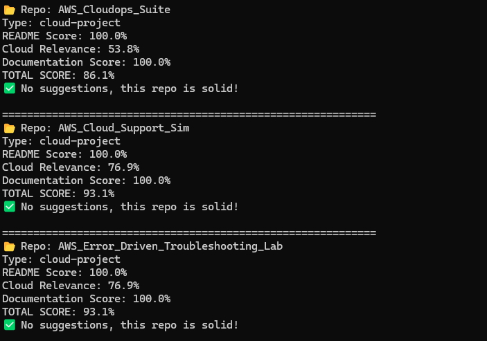
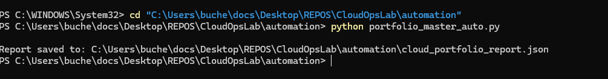

# CloudOpsLab 🚀

[](https://aws.amazon.com/)
[](https://www.python.org/)
[](https://docs.microsoft.com/en-us/powershell/)
[](https://opensource.org/licenses/MIT)

> Hands-on AWS CloudOps automation for troubleshooting, monitoring, and self-healing infrastructure

## Overview

CloudOpsLab is a practical collection of cloud operations scripts demonstrating real-world AWS troubleshooting, automation, and incident response skills. This repository showcases production-ready solutions for common CloudOps tasks that cloud support engineers, DevOps engineers, and SREs encounter daily.

**What This Demonstrates:**
- Systematic AWS troubleshooting workflows
- Automated incident detection and remediation
- Self-healing infrastructure patterns
- Production monitoring and alerting
- Cost optimization strategies
- Security auditing and compliance

**Perfect for:** Entry-level to mid-level cloud professionals building practical AWS operations experience.

## Architecture

### High-Level System Design

```
┌─────────────────────────────────────────────────────────────┐
│                    AWS Cloud Environment                     │
├─────────────────────────────────────────────────────────────┤
│                                                               │
│  ┌──────────────┐    ┌──────────────┐    ┌──────────────┐  │
│  │   Compute    │    │  Serverless  │    │   Storage    │  │
│  │   EC2/ECS    │◄───┤   Lambda     │◄───┤    S3/EBS    │  │
│  └──────┬───────┘    └──────┬───────┘    └──────┬───────┘  │
│         │                    │                    │          │
│         └────────────────────┴────────────────────┘          │
│                              │                               │
│                    ┌─────────▼──────────┐                   │
│                    │   CloudWatch       │                   │
│                    │   Logs & Metrics   │◄─── Custom        │
│                    └─────────┬──────────┘     Metrics       │
│                              │                               │
│                    ┌─────────▼──────────┐                   │
│                    │   EventBridge      │                   │
│                    │   Event Rules      │                   │
│                    └─────────┬──────────┘                   │
│                              │                               │
│         ┌────────────────────┴────────────────────┐         │
│         │                                          │         │
│  ┌──────▼────────┐                      ┌─────────▼──────┐ │
│  │ SNS Alerts    │                      │ Automation     │ │
│  │ Notifications │                      │ Scripts        │ │
│  └───────────────┘                      └────────────────┘ │
│                                                               │
└─────────────────────────────────────────────────────────────┘
```

### Repository Structure

```
CloudOpsLab/
├── troubleshooting/          # AWS diagnostic scripts
│   ├── ec2_diagnostics.py    # Instance health checks
│   ├── s3_troubleshoot.py    # Bucket analysis
│   ├── lambda_debug.py       # Function debugging
│   └── vpc_network_check.py  # Network diagnostics
│
├── automation/               # Self-healing automation
│   ├── auto_remediation.py   # Automated fixes
│   ├── self_healing_ec2.py   # Instance recovery
│   └── scheduled_cleanup.py  # Resource cleanup
│
├── monitoring/               # Observability tools
│   ├── custom_metrics.py     # CloudWatch metrics
│   ├── log_analysis.py       # Log aggregation
│   └── health_checks.py      # Endpoint monitoring
│
├── cost_optimization/        # Cost management
│   ├── resource_analyzer.py  # Usage analysis
│   ├── cost_report.py        # Cost reporting
│   └── idle_resource_finder.py # Waste detection
│
├── security/                 # Security auditing
│   ├── iam_audit.py          # IAM policy review
│   ├── security_group_check.py # SG validation
│   └── compliance_scanner.py # Compliance checks
│
└── incident_response/        # Incident management
    ├── incident_detector.py  # Automated detection
    ├── auto_responder.py     # Response playbooks
    └── root_cause_analyzer.py # RCA automation
```

## Features

### 🔍 AWS Troubleshooting

**EC2 Instance Diagnostics**
- Instance health and status check validation
- System log analysis and console output review
- Network connectivity testing (security groups, route tables)
- Performance metrics analysis (CPU, memory, disk, network)

**S3 Bucket Analysis**
- Bucket policy and permission validation
- Encryption and versioning verification
- Lifecycle policy review
- Access pattern analysis from logs

**Lambda Function Debugging**
- Execution log analysis for errors and timeouts
- Memory and duration profiling
- Cold start detection and optimization
- Concurrent execution monitoring

**VPC Network Troubleshooting**
- Security group rule validation
- Route table and subnet configuration checks
- Network ACL analysis
- VPC peering and transit gateway connectivity

### 🤖 Automation & Self-Healing

**Auto-Remediation Engine**
- Detects and automatically fixes common misconfigurations
- Restarts failed services and unhealthy instances
- Implements automated recovery workflows
- Logs all remediation actions to CloudWatch

**Scheduled Cleanup**
- Removes orphaned EBS volumes and snapshots
- Releases unattached elastic IPs
- Deletes old AMIs and outdated backups
- Enforces resource tagging policies

**Backup Automation**
- Automated EBS snapshot creation and rotation
- S3 bucket versioning management
- Cross-region backup replication
- Backup verification and testing

### 📊 Monitoring & Alerting

**Custom CloudWatch Metrics**
- Application-level business metrics
- Custom health check endpoints
- API response time tracking
- Resource utilization trending

**Log Aggregation & Analysis**
- Centralized log collection from multiple services
- Pattern-based error detection
- Automated log parsing and correlation
- Historical log analysis and reporting

**Multi-Channel Alerting**
- SNS notifications for critical events
- Email alerts with detailed incident info
- Slack/Teams integration support
- Severity-based escalation routing

### 💰 Cost Optimization

**Resource Usage Analysis**
- Identifies underutilized EC2 instances
- Detects idle RDS databases
- Finds unattached EBS volumes
- Analyzes load balancer utilization

**Cost Reporting**
- Daily/weekly automated cost summaries
- Service-level cost breakdown
- Tag-based cost allocation
- Month-over-month trending

**Right-Sizing Recommendations**
- EC2 instance optimization suggestions
- EBS volume type recommendations
- RDS instance class analysis
- Reserved Instance planning

### 🔒 Security & Compliance

**IAM Security Auditing**
- Overly permissive policy detection
- Unused credential identification
- MFA enforcement verification
- Access key rotation tracking

**Security Group Validation**
- Open port detection (0.0.0.0/0)
- Unrestricted ingress rule alerts
- Compliance with organizational policies
- Security group relationship mapping

**Encryption & Compliance**
- EBS volume encryption verification
- S3 bucket encryption status
- RDS encryption at rest checks
- CIS AWS Foundations Benchmark scanning

### 🚨 Incident Response

**Automated Detection**
- Pattern-based incident identification
- Threshold-based alerting
- Log correlation and analysis
- Service degradation detection

**Response Playbooks**
- Predefined workflows for common incidents
- Automated triage and classification
- Step-by-step remediation guides
- Escalation procedures

**Root Cause Analysis**
- Timeline reconstruction from logs
- API call analysis via CloudTrail
- Metric correlation across services
- Automated RCA report generation

## Setup

### Prerequisites

- **AWS Account** with appropriate IAM permissions
- **Python 3.9+** installed
- **AWS CLI** configured with credentials
- **boto3** (AWS SDK for Python)
- **PowerShell 5.1+** (for PowerShell scripts, optional)

### Installation

1. **Clone the repository**
```bash
git clone https://github.com/charles-bucher/CloudOpsLab.git
cd CloudOpsLab
```

2. **Install Python dependencies**
```bash
pip install -r requirements.txt
```

3. **Configure AWS credentials**
```bash
aws configure
# Enter: Access Key ID, Secret Access Key, Region, Output format
```

4. **Set environment variables (optional)**
```bash
export AWS_REGION=us-east-1
export CLOUDOPSLAB_ENV=production
export CLOUDWATCH_NAMESPACE=CloudOpsLab
```

5. **Verify installation**
```bash
python troubleshooting/ec2_diagnostics.py --help
```

### IAM Permissions Required

Minimum IAM policy for CloudOpsLab scripts:

```json
{
  "Version": "2012-10-17",
  "Statement": [
    {
      "Effect": "Allow",
      "Action": [
        "ec2:Describe*",
        "ec2:GetConsoleOutput",
        "s3:ListBucket",
        "s3:GetBucketPolicy",
        "lambda:GetFunction",
        "lambda:ListFunctions",
        "rds:Describe*",
        "cloudwatch:GetMetricStatistics",
        "cloudwatch:PutMetricData",
        "logs:DescribeLogStreams",
        "logs:GetLogEvents",
        "sns:Publish",
        "iam:GetUser",
        "iam:ListUsers"
      ],
      "Resource": "*"
    }
  ]
}
```

## Usage

### EC2 Troubleshooting

```bash
# Basic instance health check
python troubleshooting/ec2_diagnostics.py --instance-id i-1234567890abcdef0

# Detailed diagnostics with system logs
python troubleshooting/ec2_diagnostics.py --instance-id i-1234567890abcdef0 --verbose

# Check all instances in region
python troubleshooting/ec2_diagnostics.py --region us-east-1 --all-instances
```

**Example Output:**
```
✓ Instance i-1234567890abcdef0 is running
✓ Status checks: 2/2 passed
✓ System reachability: OK
✓ Instance reachability: OK
⚠ High CPU utilization: 87% (threshold: 80%)
✓ Network connectivity: OK
✓ Security groups: sg-abc123, sg-def456
```

### S3 Bucket Analysis

```bash
# Check bucket permissions and policies
python troubleshooting/s3_troubleshoot.py --bucket-name my-app-bucket

# Verify encryption and versioning
python troubleshooting/s3_troubleshoot.py --bucket-name my-app-bucket --check-encryption

# Analyze access patterns
python troubleshooting/s3_troubleshoot.py --bucket-name my-app-bucket --access-analysis
```

### Lambda Debugging

```bash
# Analyze recent invocations
python troubleshooting/lambda_debug.py --function-name my-function

# Check timeout and memory issues
python troubleshooting/lambda_debug.py --function-name my-function --performance-check

# View error logs only
python troubleshooting/lambda_debug.py --function-name my-function --errors-only
```

### Self-Healing Automation

```bash
# Enable self-healing for specific instances
python automation/self_healing_ec2.py --instance-ids i-123,i-456 --enable

# Monitor all instances with auto-recovery
python automation/self_healing_ec2.py --all-instances --auto-recover

# Dry run mode (no actions taken)
python automation/self_healing_ec2.py --all-instances --dry-run
```

**Self-Healing Actions:**
- Restart unhealthy instances automatically
- Replace failed instances from Auto Scaling Groups
- Send SNS alerts to administrators
- Log all recovery actions to CloudWatch

### Cost Optimization

```bash
# Generate comprehensive cost report
python cost_optimization/resource_analyzer.py --full-report

# Find idle resources
python cost_optimization/idle_resource_finder.py --region us-east-1

# Get right-sizing recommendations
python cost_optimization/resource_analyzer.py --rightsizing-recommendations
```

**Example Output:**
```
💰 Cost Optimization Opportunities:

1. Idle EC2 Instances (7 found)
   • i-abc123: t3.large, stopped 45d → $50/month savings
   • i-def456: m5.xlarge, <5% CPU → $120/month savings

2. Unattached EBS Volumes (12 found)
   • vol-123: 500GB gp3, unused 90d → $40/month
   • vol-456: 1TB io2, unused 30d → $125/month

Total Potential Monthly Savings: $338.60
```

### CloudWatch Monitoring

```bash
# Create custom metric
python monitoring/custom_metrics.py --metric-name AppResponseTime --value 245

# Configure CloudWatch alarms
python monitoring/health_checks.py --create-alarm --metric CPUUtilization --threshold 80

# Analyze logs
python monitoring/log_analysis.py --log-group /aws/lambda/my-function --start-time 1h
```

### Security Auditing

```bash
# Audit IAM users and policies
python security/iam_audit.py --check-mfa --check-access-keys

# Security group analysis
python security/security_group_check.py --region us-east-1 --check-open-ports

# Compliance scanning
python security/compliance_scanner.py --benchmark cis --output-format pdf
```

### Incident Response

```bash
# Monitor for incidents
python incident_response/incident_detector.py --monitor

# Trigger automated response
python incident_response/auto_responder.py --incident-type high-cpu --instance-id i-123

# Root cause analysis
python incident_response/root_cause_analyzer.py --incident-id INC-2024-001
```

## Screenshots

### Portfolio Analysis & Automation Results

**Cloud Portfolio Scan Results**



*Automated analysis of cloud infrastructure showing resource inventory, compliance status, and optimization opportunities*

**Portfolio Master Auto-Run**



*Automated portfolio management execution demonstrating scheduled scans, monitoring, and reporting workflows*

**Repository Auto-Fixer Results**


*Automated remediation results showing detected issues, applied fixes, and verification status*

**Safe Auto-Fixer Results**


*Safe mode auto-remediation with dry-run analysis and recommendation engine output*

---

## Skills Demonstrated

This repository showcases practical skills essential for cloud operations roles:

### Cloud Platform Expertise
- ✅ AWS Core Services: EC2, S3, Lambda, RDS, VPC, CloudWatch, IAM
- ✅ AWS CLI & SDK: boto3 (Python) automation
- ✅ Multi-Region Operations: Cross-region management and disaster recovery

### Troubleshooting & Diagnostics
- ✅ Log Analysis: CloudWatch Logs, VPC Flow Logs, CloudTrail
- ✅ Performance Debugging: CPU, memory, network, disk I/O
- ✅ Root Cause Analysis: Systematic problem identification
- ✅ Network Troubleshooting: Security groups, NACLs, route tables

### Automation & Scripting
- ✅ Python: boto3, error handling, API integration
- ✅ PowerShell: Windows automation
- ✅ Bash: Linux system administration
- ✅ Infrastructure as Code: Terraform, CloudFormation basics

### Monitoring & Observability
- ✅ CloudWatch: Custom metrics, alarms, dashboards, log insights
- ✅ Alerting: SNS, email, Slack integration
- ✅ Health Checks: Endpoint monitoring, availability testing
- ✅ Performance Metrics: KPI tracking, capacity planning

### DevOps & SRE Practices
- ✅ Self-Healing Systems: Automated remediation workflows
- ✅ Incident Management: Detection, response, post-mortems
- ✅ Change Management: Safe deployments, rollback procedures
- ✅ CI/CD Understanding: Deployment automation, testing

### Security & Compliance
- ✅ IAM Best Practices: Least privilege, MFA enforcement
- ✅ Security Auditing: Vulnerability scanning, compliance
- ✅ Encryption: At-rest and in-transit validation
- ✅ Compliance Standards: CIS Benchmarks, AWS Well-Architected

### Cost Management
- ✅ Cost Analysis: Service-level breakdown and trending
- ✅ Resource Optimization: Right-sizing, idle detection
- ✅ Budget Management: Cost allocation, alerts
- ✅ RI Planning: Coverage and utilization analysis

### Communication & Documentation
- ✅ Technical Documentation: Clear README files, code comments
- ✅ Incident Reports: Structured post-incident docs
- ✅ Runbooks: Step-by-step operational procedures
- ✅ Knowledge Sharing: Organized repository structure

## Configuration

### Environment Variables

```bash
# AWS Configuration
export AWS_REGION=us-east-1
export AWS_PROFILE=cloudops

# CloudOpsLab Settings
export CLOUDOPSLAB_ENV=production
export CLOUDOPSLAB_LOG_LEVEL=INFO
export CLOUDWATCH_NAMESPACE=CloudOpsLab

# Monitoring
export HEALTH_CHECK_INTERVAL=60
export METRIC_RETENTION_DAYS=90

# Cost Optimization
export IDLE_RESOURCE_THRESHOLD_DAYS=30
export CPU_UTILIZATION_THRESHOLD=5
```

### Configuration File (config.yaml)

```yaml
aws:
  region: us-east-1
  profile: default
  
monitoring:
  cloudwatch_namespace: CloudOpsLab
  metric_retention_days: 90
  health_check_interval: 60

automation:
  self_healing_enabled: true
  cleanup_schedule: "0 3 * * *"
  backup_schedule: "0 1 * * *"

cost_optimization:
  idle_threshold_days: 30
  cpu_threshold_percent: 5
  report_schedule: "0 8 * * MON"

security:
  mfa_required: true
  encryption_required: true
  compliance_scan_schedule: "0 2 * * *"

logging:
  level: INFO
  format: "%(asctime)s - %(name)s - %(levelname)s - %(message)s"
```

## Testing

```bash
# Run all tests
pytest tests/

# Run specific test module
pytest tests/test_troubleshooting.py

# Run with coverage
pytest --cov=cloudopslab tests/
```

## Related Projects

- [AWS Error-Driven Troubleshooting Lab](https://github.com/charles-bucher/AWS_Error_Driven_Troubleshooting_Lab)
- [AWS Cloud Support Simulator](https://github.com/charles-bucher/AWS_Cloud_Support_Sim)
- [AWS CloudOps Suite](https://github.com/charles-bucher/AWS_Cloudops_Suite)

## Contributing

Contributions welcome! Please:

1. Fork the repository
2. Create feature branch (`git checkout -b feature/AmazingFeature`)
3. Commit changes (`git commit -m 'Add AmazingFeature'`)
4. Push to branch (`git push origin feature/AmazingFeature`)
5. Open Pull Request

## License

This project is licensed under the MIT License.

```
MIT License

Copyright (c) 2024 Charles Bucher

Permission is hereby granted, free of charge, to any person obtaining a copy
of this software and associated documentation files (the "Software"), to deal
in the Software without restriction, including without limitation the rights
to use, copy, modify, merge, publish, distribute, sublicense, and/or sell
copies of the Software, and to permit persons to whom the Software is
furnished to do so, subject to the following conditions:

The above copyright notice and this permission notice shall be included in all
copies or substantial portions of the Software.

THE SOFTWARE IS PROVIDED "AS IS", WITHOUT WARRANTY OF ANY KIND, EXPRESS OR
IMPLIED, INCLUDING BUT NOT LIMITED TO THE WARRANTIES OF MERCHANTABILITY,
FITNESS FOR A PARTICULAR PURPOSE AND NONINFRINGEMENT. IN NO EVENT SHALL THE
AUTHORS OR COPYRIGHT HOLDERS BE LIABLE FOR ANY CLAIM, DAMAGES OR OTHER
LIABILITY, WHETHER IN AN ACTION OF CONTRACT, TORT OR OTHERWISE, ARISING FROM,
OUT OF OR IN CONNECTION WITH THE SOFTWARE OR THE USE OR OTHER DEALINGS IN THE
SOFTWARE.
```

## Contact

**Charles Bucher**  
AWS Cloud Support & DevOps Engineer

- 📧 Email: quietopscb@gmail.com
- 💼 LinkedIn: [charles-bucher-cloud](https://linkedin.com/in/charles-bucher-cloud)
- 🌐 Portfolio: [charles-bucher.github.io](https://charles-bucher.github.io/)
- 💻 GitHub: [@charles-bucher](https://github.com/charles-bucher)

---

**Built with ☁️ by Charles Bucher**

*Demonstrating production-ready cloud operations skills through hands-on projects*

  