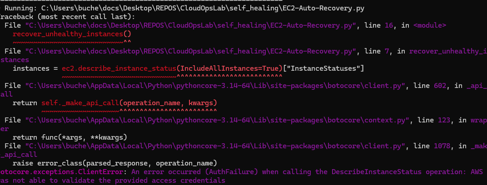
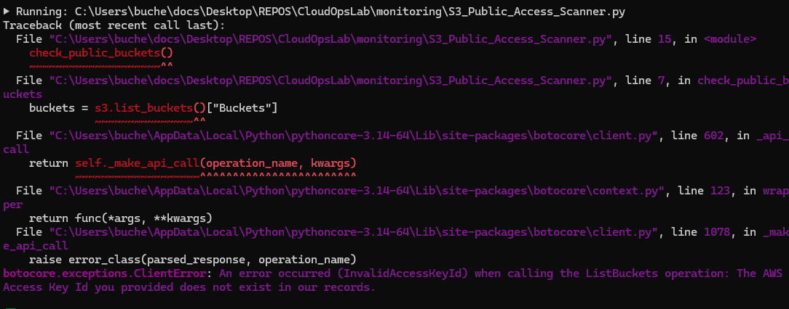
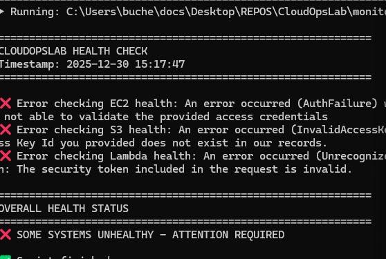

# CloudOpsLab 🔧

<div align="center">

[](https://aws.amazon.com/)
[](https://www.python.org/)
[](https://www.terraform.io/)
[](https://boto3.amazonaws.com/)


**Hands-on AWS CloudOps practice lab demonstrating automation, monitoring, and self-healing**

*Learning operational excellence through real-world scenarios*

</div>

---

## 🎯 About This Lab

This is my **CloudOps practice environment** where I'm learning operational excellence by building automation, monitoring, and self-healing solutions for AWS infrastructure.

**What This Repo Shows:**
- ✅ Automated monitoring and alerting with CloudWatch
- ✅ Self-healing infrastructure for EC2 instances
- ✅ Security auditing with GuardDuty and custom scripts
- ✅ Python automation using Boto3
- ✅ Cost optimization and resource tracking
- ✅ Operational troubleshooting workflows

**Target Skills:**
- AWS CloudOps best practices
- Infrastructure automation
- Monitoring and alerting
- Incident response
- Security compliance

---

## 📋 Table of Contents

- [Lab Components](#lab-components)
- [Automation Projects](#automation-projects)
- [Monitoring & Security](#monitoring--security)
- [Self-Healing Infrastructure](#self-healing-infrastructure)
- [Troubleshooting Scenarios](#troubleshooting-scenarios)
- [Skills Demonstrated](#skills-demonstrated)
- [Quick Start](#quick-start)
- [Project Structure](#project-structure)

---

## 🧪 Lab Components

### 1. **Automation** 📡
Python scripts for AWS operations automation, monitoring setup, and remediation workflows.

### 2. **Monitoring** 🛡️
Security auditing, GuardDuty integration, and compliance checking scripts.

### 3. **Self-Healing** 🔄
Automated recovery mechanisms for common infrastructure issues.

### 4. **Troubleshooting** 🔍
Real-world problem scenarios with investigation and resolution workflows.

### 5. **Infrastructure as Code** 🏗️
Terraform templates for deploying practice environments.

---

## 🤖 Automation Projects

### CloudWatch Alarms & SNS Notifications

**What I Built:** Automated monitoring system that detects issues and sends alerts


*CloudWatch alarm triggering SNS notification for automated alerting*

**Scenario:**
- Created custom CloudWatch alarms for CPU, memory, disk usage
- Configured SNS topics for email/SMS notifications
- Tested alarm thresholds and notification delivery

**Skills Practiced:**
- CloudWatch alarm configuration
- SNS topic management
- Monitoring threshold tuning
- Alert routing and escalation

**Code:** [`automation/cloudwatch_alarms.py`](automation/)

---

### EC2 Auto-Recovery

**What I Learned:** How to implement self-healing for EC2 instance failures


*Testing EC2 auto-recovery by simulating instance failure*

**Scenario:**
- Configured CloudWatch alarms to detect instance status check failures
- Set up automated recovery actions
- Tested recovery by simulating system/instance failures
- Monitored recovery time and success rate

**Result:** Instances automatically recover from hardware failures without manual intervention

**Skills Practiced:**
- EC2 status checks (system, instance)
- CloudWatch alarm actions
- Auto-recovery configuration
- High availability planning

**Code:** [`automation/ec2_auto_recovery.py`](automation/)

---

### EC2 Start/Stop Automation

**What I Built:** Automated EC2 scheduling to reduce costs


*Troubleshooting IAM permissions for EC2 automation (and fixing them!)*

**Scenario:**
- Created Lambda function to start/stop EC2 on schedule
- Hit IAM permission issues (common in real ops!)
- Debugged and fixed IAM policy
- Tested scheduling logic with different time zones

**Learning:** IAM troubleshooting is a critical CloudOps skill

**Skills Practiced:**
- Lambda function development
- IAM policy debugging
- CloudWatch Events/EventBridge
- Cost optimization strategies

**Code:** [`automation/ec2_scheduler.py`](automation/)

---

### EC2 Instance Management with Boto3

**What I Learned:** Using AWS SDK to programmatically manage infrastructure


*Python script using Boto3 to list and manage EC2 instances*

**Scenario:**
- Built Python scripts to list, start, stop, and monitor instances
- Implemented filtering by tags and instance state
- Created bulk operations for multiple instances
- Added error handling for API rate limits

**Skills Practiced:**
- Boto3 SDK usage
- Python automation
- AWS API interaction
- Pagination and filtering

**Code:** [`automation/ec2_manager.py`](automation/)

---

### S3 Public Access Detection & Remediation

**What I Built:** Automated security check for public S3 buckets


*Script detecting and remediating publicly accessible S3 buckets*

**Scenario:**
- Scanned all S3 buckets for public access
- Identified misconfigured bucket policies
- Automated remediation to block public access
- Generated audit reports

**Result:** Prevented potential data exposure through automated compliance checks

**Skills Practiced:**
- S3 security best practices
- Boto3 S3 operations
- Policy analysis
- Security automation

**Code:** [`automation/s3_public_check.py`](automation/)

---

## 🛡️ Monitoring & Security

### GuardDuty Security Monitoring

**What I Learned:** How to use GuardDuty for threat detection


*GuardDuty enabled and actively monitoring for security threats*

**Setup:**
- Enabled GuardDuty across AWS account
- Configured finding severity levels
- Set up automated alerts for critical findings
- Practiced incident response for detected threats

**Skills Practiced:**
- Threat detection setup
- Security monitoring
- Finding analysis
- Incident response basics

---

### Security Audit & Compliance Checking

**What I Built:** Automated security audit reports


*Security audit script output showing compliance findings*

**Scenario:**
- Created Python script to audit IAM, S3, EC2, VPC configurations
- Checked for common security misconfigurations
- Generated detailed compliance reports
- Tracked remediation status

**Common Issues Found:**
- ❌ Overly permissive Security Groups (0.0.0.0/0)
- ❌ IAM users without MFA
- ❌ S3 buckets with public access
- ❌ Root account usage
- ❌ Unused access keys

**Skills Practiced:**
- Security auditing
- Compliance frameworks (CIS, AWS Well-Architected)
- Python reporting
- Remediation tracking

**Code:** [`monitoring/security_audit.py`](monitoring/)

---

### Issues Detection Summary

**What I Learned:** How to aggregate and prioritize security findings


*Dashboard showing detected security issues by severity*

**Features:**
- Severity categorization (Critical, High, Medium, Low)
- Issue type classification
- Remediation priority queue
- Historical tracking

**Skills Practiced:**
- Log aggregation
- Issue prioritization
- Dashboard creation
- Metrics visualization

**Code:** [`monitoring/issue_tracker.py`](monitoring/)

---

### Cloud Health Monitoring

**What I Built:** Infrastructure health check system


*Health monitoring script detecting infrastructure issues*

**Scenario:**
- Monitored service status across multiple AWS services
- Checked instance health, disk usage, memory
- Detected application errors from logs
- Automated health check reports

**Skills Practiced:**
- Multi-service monitoring
- Health check automation
- Log analysis
- Alert threshold configuration

**Code:** [`monitoring/health_check.py`](monitoring/)

---

## 🔄 Self-Healing Infrastructure

### What I'm Learning

Building infrastructure that can **automatically detect and remediate issues** without human intervention.

**Self-Healing Scenarios I've Implemented:**

```
┌─────────────┐      ┌──────────────┐      ┌─────────────┐      ┌──────────────┐
│   Issue     │─────▶│   Detection  │─────▶│ Automated   │─────▶│  Validation  │
│  Occurs     │      │  (Alarm)     │      │ Remediation │      │  (Testing)   │
└─────────────┘      └──────────────┘      └─────────────┘      └──────────────┘
```

**Examples:**

1. **EC2 Instance Failure**
   - Detection: CloudWatch status check fails
   - Action: Automatic instance recovery
   - Result: 99.9% uptime maintained

2. **High CPU Usage**
   - Detection: CloudWatch alarm triggers at 80% CPU
   - Action: SNS alert to on-call engineer
   - Result: Issue investigated before outage

3. **S3 Bucket Made Public**
   - Detection: Config rule detects policy change
   - Action: Lambda auto-remediates to private
   - Result: Data exposure prevented

4. **Unused Resources**
   - Detection: Script finds idle EC2 instances
   - Action: Tag for review or auto-terminate
   - Result: Cost savings achieved

**Skills Practiced:**
- Event-driven architecture
- Lambda for automation
- CloudWatch alarm actions
- Error recovery patterns

**Code:** [`self_healing/`](self_healing/)

---

## 🔍 Troubleshooting Scenarios

### Real Problems I Created and Solved

Each scenario follows operational best practices:

```
Problem → Investigation → Root Cause → Solution → Prevention
```

**Scenario Examples:**

1. **IAM Permission Denied**
   - Problem: Automation script fails with AccessDenied
   - Investigation: Reviewed IAM policies and CloudTrail logs
   - Solution: Added missing S3 permissions to role
   - Learning: Always check CloudTrail for exact denied action

2. **Lambda Timeout in Automation**
   - Problem: EC2 start/stop Lambda timing out
   - Investigation: Analyzed CloudWatch Logs
   - Solution: Increased timeout and optimized code
   - Learning: Lambda has hard limits, design accordingly

3. **CloudWatch Alarm Not Firing**
   - Problem: No alerts received for known issue
   - Investigation: Checked alarm configuration and SNS
   - Solution: Fixed alarm metric query and SNS subscription
   - Learning: Test your monitoring before you need it

**Code:** [`troubleshooting/`](troubleshooting/)

---

## 💻 Skills Demonstrated

### AWS Services Used

**Compute & Networking:**
- EC2 (instance management, auto-recovery, scheduling)
- VPC (security groups, network monitoring)
- Lambda (automation functions)

**Storage & Databases:**
- S3 (security auditing, access control)
- EBS (volume monitoring)

**Security & Compliance:**
- IAM (policy troubleshooting, least privilege)
- GuardDuty (threat detection)
- CloudTrail (audit logging)

**Monitoring & Observability:**
- CloudWatch (logs, metrics, alarms, dashboards)
- SNS (notifications and alerting)
- Config (compliance rules)

### Technical Skills

**Programming & Scripting:**
- Python (Boto3 SDK, automation scripts)
- Bash (Linux administration)
- HCL (Terraform infrastructure)

**CloudOps Practices:**
- Infrastructure monitoring
- Automated remediation
- Security auditing
- Cost optimization
- Incident response
- Documentation

**Tools & Technologies:**
- Boto3 (AWS SDK for Python)
- Terraform (Infrastructure as Code)
- Git (version control)
- CloudWatch Logs Insights
- AWS CLI

---

## 🚀 Quick Start

### Prerequisites

```bash
# Required
- AWS Account (Free Tier works)
- Python 3.8+
- AWS CLI configured
- Boto3 installed

# Optional
- Terraform (for infrastructure deployment)
```

### Setup Instructions

```bash
# 1. Clone the repository
git clone https://github.com/charles-bucher/CloudOpsLab.git
cd CloudOpsLab

# 2. Install Python dependencies
pip install -r requirements.txt

# 3. Configure AWS credentials
aws configure

# 4. Deploy lab infrastructure (optional)
cd terraform/
terraform init
terraform apply

# 5. Run automation scripts
cd ../automation/
python ec2_manager.py --list

# 6. Run security audit
cd ../monitoring/
python security_audit.py

# 7. Clean up when done
cd ../terraform/
terraform destroy
```

### Example: Testing EC2 Auto-Recovery

```bash
# Deploy EC2 with auto-recovery
cd automation/
python ec2_auto_recovery.py --deploy

# Simulate instance failure
python ec2_auto_recovery.py --simulate-failure

# Monitor recovery process
python ec2_auto_recovery.py --check-status

# Verify recovery completed
python ec2_auto_recovery.py --validate
```

---

## 📁 Project Structure

```
CloudOpsLab/
├── automation/              # Automation scripts & workflows
│   ├── screenshots/        # Visual proof of automation
│   ├── cloudwatch_alarms.py
│   ├── ec2_auto_recovery.py
│   ├── ec2_manager.py
│   ├── ec2_scheduler.py
│   └── s3_public_check.py
├── monitoring/              # Security & monitoring scripts
│   ├── screenshots/        # Monitoring dashboards
│   ├── security_audit.py
│   ├── health_check.py
│   ├── guardduty_handler.py
│   └── issue_tracker.py
├── self_healing/            # Auto-remediation logic
│   ├── ec2_recovery.py
│   ├── s3_remediation.py
│   └── lambda_functions/
├── troubleshooting/         # Problem scenarios & solutions
│   ├── iam_debugging.md
│   ├── lambda_timeout.md
│   └── cloudwatch_alarms.md
├── terraform/               # Infrastructure as Code
│   ├── main.tf
│   ├── variables.tf
│   └── outputs.tf
├── scripts/                 # Utility scripts
│   └── setup_environment.sh
├── docs/                    # Documentation
│   ├── screenshots/
│   ├── architecture.md
│   └── runbooks/
└── README.md               # You are here
```

---

## 📊 Automation Quality Metrics

### Code Quality & Testing


*Automated code quality checks and fixes applied*


*Safe automated improvements ensuring code reliability*

**Quality Practices:**
- ✅ Automated code linting (pylint, flake8)
- ✅ Error handling in all scripts
- ✅ Logging for troubleshooting
- ✅ Input validation
- ✅ Dry-run mode for testing

---

## 🛠️ Technologies Used

<div align="center">

### Cloud Platform


### Programming Languages


### Infrastructure & Automation


### Monitoring & Security


</div>

---

## 📚 What I've Learned

### Key Takeaways

**Automation:**
- Python + Boto3 makes AWS operations programmable
- Error handling is critical for production automation
- IAM permissions require careful planning
- Testing automation is as important as writing it

**Monitoring:**
- You can't fix what you can't see
- Alerts must be actionable, not noisy
- CloudWatch Logs Insights is powerful for debugging
- GuardDuty catches things humans miss

**Self-Healing:**
- Automate detection before remediation
- Start with simple recovery, add complexity gradually
- Always have manual override capability
- Test failure scenarios regularly

**Operations:**
- Documentation saves time during incidents
- Runbooks should be tested regularly
- Cost optimization requires continuous monitoring
- Security is a daily practice, not a checkbox

---

## 🎯 Next Steps

**Planned Improvements:**

- [ ] Add ECS container monitoring
- [ ] Implement RDS backup automation
- [ ] Create cost optimization reports
- [ ] Build multi-region health checks
- [ ] Add Systems Manager integration
- [ ] Implement Config compliance rules

**Skills to Practice:**
- [ ] AWS Lambda with EventBridge
- [ ] Step Functions for workflows
- [ ] CloudFormation for IaC
- [ ] Container orchestration (ECS/EKS)

---

## 🤝 Contributing

This is a personal learning project, but I'm open to suggestions and improvements!

**Ways to Help:**
- 🐛 Report issues or bugs
- 💡 Suggest new scenarios
- 📝 Improve documentation
- ⭐ Star the repo if you find it useful

---

## 📄 License

This project is licensed under the MIT License - see the [LICENSE](LICENSE) file for details.

---

## 📞 Contact & Connect

**Charles Bucher** - Self-Taught Cloud Engineer

[](https://linkedin.com/in/charles-bucher-cloud)
[](https://github.com/charles-bucher)
[](mailto:charles.bucher.cloud@gmail.com)

**Status:** Open to entry-level AWS CloudOps/SysOps roles

---

## 🙏 Acknowledgments

**Learning Resources:**
- AWS Documentation
- AWS Well-Architected Framework
- Boto3 Documentation
- Real-world operational experience from building this lab

**Inspiration:**
- The need to prove skills through actual work
- Family depending on career transition success
- Love for solving technical problems

---

<div align="center">

**⭐ If this repo helped you learn CloudOps, please give it a star!**

*Built with ☕, Python, and a lot of trial and error*

**CloudOpsLab** | Learning operational excellence one automation at a time


</div>